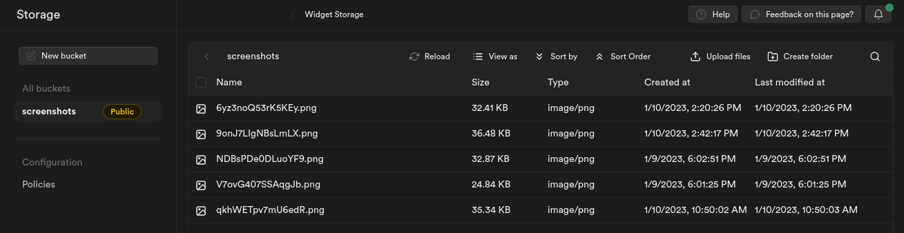

# NLW Return | Feedback Widget & Supabase Storage


> Project carried out at the `NLW Return` event, where we built a feedback widget in which the user can send different types of feedback
> so that the application has a prioritization filtering in the collection of these feedbacks, it can also send a Screenshot of the
> application if you encounter any problems. For the widget to work properly on the web, I used four platforms that offer services
> distinct: `Planet Scale` to scale from a MySQL Database, `Supabase Storage` to generate a valid URL for the image on the web (since some
> email services do not support images in Base64 format), `Railway` to upload the backend of the application and `Vercel` to host the frontend, with
> this practiced promoting settings from a `development environment` to a `production environment`, how to configure environment variables
> and build scripts, in addition to connecting different `Cloud Computing` services existing on the web such as `Backend as a Service (BaaS)`, `Cloud
> Database or Database as a Service (DBaaS)`, `Storage as a Service ( STaaS)` and `Platform as a Service (PaaS)`.

:arrow_right: Screenshot implementation with Supabase Storage <br />
:arrow_right: Repository Pattern and Dependency Injection (DI) <br />
:arrow_right: Adapter Pattern <br />
:arrow_right: Deployment Settings and Environment Variables <br />

<br />

## Screenshot implementation with Supabase Storage

In this topic I will detail the flow of one of the features of this project, which is the screenshot feature, this project has a simple backend with a single `route` with a single `endpoint`, so the screenshot feature follows the same flow as the upload of feedback, but with only a few deviations.

Gmail, one of the most used webmail services in the world, does not support base64 rendering of images, the `src` property of images must contain a `URL` following the `HTTP` protocol, so it was necessary to `convert the generated image into base64 to a file and store it on a cloud storage service that will provide a public URL`.

```tsx
// src/components/WidgetForm/Steps/FeedbackContentStep.tsx

<ScreenshotButton
  screenshot={screenshot}
  onScreenshotTook={setScreenshot}
/>

// src/components/WidgetForm/ScreenshotButton.tsx

export function ScreenshotButton({
  screenshot,
  onScreenshotTook,
}: ScreenshotButtonProps) {
  const [isTakingScreenshot, setIsTakingScreenshot] = useState(false)

  async function handleTakeScreenshot() {
    setIsTakingScreenshot(true)

    const canvas = await html2canvas(document.querySelector('html')!)
    const base64image = canvas.toDataURL('img/png')

    onScreenshotTook(base64image)
    setIsTakingScreenshot(false)
  }

  // ...

  return (
    <button
      type="button"
      onClick={handleTakeScreenshot}
      className={style.withoutScreenshot}
    >
      {isTakingScreenshot ? <Loading /> : <Camera className="w-6 h-6" />}
    </button>
  )
}
```

### html2canvas Library

The script allows you to take `"screenshots"` of webpages or parts of it, directly on the users browser. `The screenshot is based on the DOM` and `as such may not be 100% accurate to the real representation as it does not make an actual screenshot, but builds the screenshot based on the information available on the page`.

The script traverses through the `DOM` of the page it is loaded on. `It gathers information on all the elements there, which it then uses to build a representation of the page`. In other words, it does not actually take a screenshot of the page, but builds a representation of it based on the properties it reads from the DOM.

As a result, `it is only able to render correctly properties that it understands, meaning there are many CSS properties which do not work`. For a full list of supported CSS properties, check out the supported features page.

`All the images` that the script uses need to reside under the `same origin` for it to be able to read them without the assistance of a proxy. Similarly, if you have other canvas elements on the page, which have been tainted with `cross-origin content`, they will become dirty and no longer readable by html2canvas.

```ts
// web/node_modules/html2canvas/dist/types/index.d.ts

declare const html2canvas: (element: HTMLElement, options?: Partial<Options>) => Promise<HTMLCanvasElement>;
```

The `html2canvas function` takes as an argument the element that should be generated ("which should have a Screenshot"), and returns an `HTMLCanvasElement`.

### HTMLCanvasElement

The `HTMLCanvasElement interface provides properties and methods for manipulating the layout and presentation of screen elements`. The `HTMLCanvasElement` interface also inherits the properties and methods of the `HTMLElement` interface.

 - <strong>Method: HTMLCanvasElement.toDataURL()</strong>

Returns a `data-URL containing a representation of the image in the format specified by the type parameter` (defaults to image/png). The returned image is in a resolution of 96dpi.

```tsx
const canvas = await html2canvas(document.querySelector('html')!)
const base64image = canvas.toDataURL('image/png')

console.log(base64image)
```

```
>> data:image/png;base64,iVBORw0KGgoAAAANSUhEUgAABVYAAADlCAYAAAC4X6xuAAAgAElEQVR4Xu3dB5idVYE38DPpk0mvJAQSEggEpIYukFAFKYoUF7F8a0FQ1
/1UVv12bbhW7LIKoujqLmJBRXo3CR1CFQKEmiAkoYVJZlImM8n3njfcycxkyr137ty5987v5SEk9576O+/wPPw573mrqquHbgouAgQIECBAgAABAgQIECBAoGACmzZ1/Z/amTIjR45O+t0UYpXW9TZ
/1vraut05c44Jd945r2Bj1xABAgSKIXDwwXPD/Pk3ttNVVavPqtI
/bvmsKvkg81lt7cq0bPysqyubMl210fb7KsFqrmTKEyBAgAABAgQIECBAgACBzgUEq+4QAgQIdC4gWHWHECBAgAABAgQIECBAgAABAlsJCFbdFAQIEBCsugcIECBAgAABAgQIECBAgACBHAUEqzmCKU6AQJ
8TsGO1zy25CRMgQIAAAQIECBAgQIAAga4FBKtdGylBgEDfFhCs9u31N3sCBAgQIECAAAECBAgQINCugGDVjUGAAIHOBQSr7hACBAgQIECAAAECBAgQIEBgKwHBqpuCAAECglX3AAECBAgQIECAAAECBAgQI
JCjgGA1RzDFCRDocwJ2rPa5JTdhAgQIECBAgAABAgQIECDQtYBgtWsjJQgQ6NsCgtW+vf5mT4AAAQIECBAgQIAAAQIE2hUQrLoxCBAg0LmAYNUdQoAAAQIECBAgQIAAAQIECGwlIFh1UxAgQECw6h4gQIAA
AQIECBAgQIAAAQIEchQQrOYIpjgBAn1OwI7VPrfkJkyAAAECBAgQIECAAAECBLoWEKx2baQEAQJ9W0Cw2rfX3+wJECBAgAABAgQIECBAgEC7AoJVNwYBAgQ6FxCsukMIECBAgAABAgQIECBAgACBr
// ...
```

### handleSubmmitFeedback

In order to send the feedback to the backend, we must first `convert the base64 string image generated in the frontend into a file` and this file must be sent to some `file storage service`, many services that provide `Backend as a Service ` currently also provide some kind of `Cloud Storage` service such as `Firebase Storage` or `Supabase Storage`, in this project we implement Supabase to the fronend to send our file.

```ts
// src/lib/supabase.ts

import { createClient } from '@supabase/supabase-js'

const supabaseUrl = import.meta.env.VITE_NEXT_PUBLIC_SUPABASE_URL
const supabaseAnonKey = import.meta.env.VITE_NEXT_PUBLIC_SUPABASE_ANON_KEY

export const supabase = createClient(supabaseUrl, supabaseAnonKey)
```

To instantiate the Supabase client and access the credentials, first we must `create a new project in Supabase`, and then go to `Storage and create a new Bucket`, in this case the bucket created was `screenshots`, a bucket is like if it was a root folder in which you will identify your resources, the scope of files that will be stored there. 

```tsx
// src/components/WidgetForm/Steps/FeedbackContentStep.tsx

const STORAGE_URL = `https://oxgapcqpowafqdnxqmoe.supabase.co/storage/v1/object/public/screenshots/`

async function handleSubmmitFeedback(event: FormEvent) {
  event.preventDefault()
  setSendingFeedback(true)

  if (screenshot) {
    const uid = new ShortUniqueId({ length: 15 })
    const fileName = `${uid()}.png`

    function dataURLtoFile(dataurl: any, filename: string) {
      var arr = dataurl.split(','),
        mime = arr[0].match(/:(.*?);/)[1],
        bstr = atob(arr[1]),
        n = bstr.length,
        u8arr = new Uint8Array(n)
      while (n--) {
        u8arr[n] = bstr.charCodeAt(n)
      }
      return new File([u8arr], filename, { type: mime })
    }

    const file = dataURLtoFile(screenshot, fileName)
    const imageUrl = STORAGE_URL + fileName

    await supabase.storage
      .from('screenshots')
      .upload(fileName, file, {
        cacheControl: '3600',
        upsert: false,
      })
      .then(async () => {
        await api.post('/feedbacks', {
          type: feedbackType,
          comment,
          screenshot: imageUrl,
        })
      })
      .catch((error) => console.log(error))
  } else {
    await api.post('/feedbacks', {
      type: feedbackType,
      comment,
      screenshot,
    })
  }

  setSendingFeedback(false)
  onFeedbackSent()
}
```

After configuring the storage environment in Supabase and instance of your client in our project, we can have access to all possible data management methods for our cloud backend, including methods related to Storage. So we can store our image in the subbase bucket with the following call:

```tsx
await supabase.storage
  .from('screenshots')
  .upload(fileName, file, {
    cacheControl: '3600',
    upsert: false,
  })
  .then(async () => {
    await api.post('/feedbacks', {
      type: feedbackType,
      comment,
      screenshot: imageUrl,
    })
  })
  .catch((error) => console.log(error))
```

So if there is a screenshot, the API call will only be made if the image was successfully saved, so we have access to the public URL of our image with `STORAGE_URL + fileName`:

<div align="center">

</div>

*<i>html2canvas.hertzen.com</i> <br />
*<i>developer.mozilla.org/pt-BR/docs/Web/API/HTMLCanvasElement</i> <br />
